# State Diagram – Lexical Analyzer (Q2)

```mermaid
stateDiagram-v2
    [*] --> S0 : Start

    S0 --> S1 : "ch = '<'"
    S0 --> S2 : "ch = '>'"
    S0 --> S3 : "ch = '='"
    S0 --> S4 : "ch = '!'"
    S0 --> S5 : "ch = '&'"
    S0 --> S6 : "ch = '|'"
    S0 --> S7 : "isalpha(ch)"
    S0 --> S8 : "isdigit(ch)"
    S0 --> S0 : "+-*/% → Arithmetic Op"
    S0 --> S0 : ";,  → Special Symbol"
    S0 --> S0 : "whitespace → skip"
    S0 --> S0 : "other → Lexical Error"

    S1 --> S0 : "ch = '=' → emit <="
    S1 --> S0 : "other → emit <"

    S2 --> S0 : "ch = '=' → emit >="
    S2 --> S0 : "other → emit >"

    S3 --> S0 : "ch = '=' → emit =="
    S3 --> S0 : "other → emit ="

    S4 --> S0 : "ch = '=' → emit !="
    S4 --> S0 : "other → emit !"

    S5 --> S0 : "ch = '&' → emit &&"
    S5 --> S0 : "other → no emit"

    S6 --> S0 : "ch = '|' → emit ||"
    S6 --> S0 : "other → no emit"

    S7 --> S7 : "isalnum(ch) → accumulate"
    S7 --> S0 : "other → emit Keyword/Identifier"

    S8 --> S8 : "isdigit(ch) → accumulate"
    S8 --> S0 : "other → emit Constant"
```

| State | Purpose |
|-------|---------|
| **S0** | Initial / idle state – classifies the first character |
| **S1** | Seen `<` – decide `<` or `<=` |
| **S2** | Seen `>` – decide `>` or `>=` |
| **S3** | Seen `=` – decide `=` (assignment) or `==` (relational) |
| **S4** | Seen `!` – decide `!` (NOT) or `!=` (relational) |
| **S5** | Seen `&` – decide `&&` (logical AND) |
| **S6** | Seen `\|` – decide `\|\|` (logical OR) |
| **S7** | Reading an identifier/keyword (letters + digits) |
| **S8** | Reading a numeric constant (digits) |
